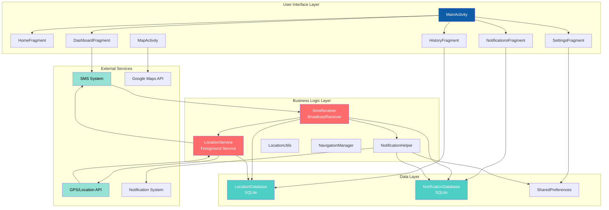
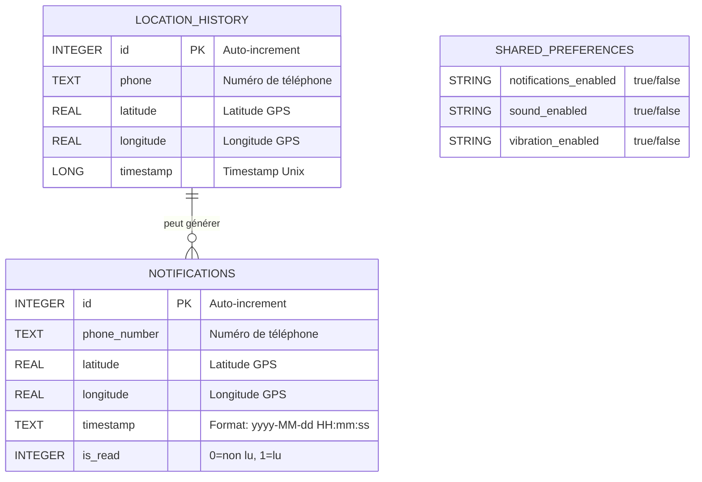

# Architecture FyourF - Diagrammes et Explications

## Table des Matières
1. [Vue d'ensemble de l'architecture](#vue-densemble-de-larchitecture)
2. [Diagramme des composants](#diagramme-des-composants)
3. [Flux de communication](#flux-de-communication)
4. [Modèle de données](#modèle-de-données)
5. [Cycle de vie du service](#cycle-de-vie-du-service)
6. [Patterns et principes](#patterns-et-principes)

---

## Vue d'ensemble de l'architecture

FyourF utilise une architecture en couches (Layered Architecture) avec séparation claire des responsabilités:

### Couches principales

1. **User Interface Layer** (Couche Présentation)
   - Activities et Fragments
   - Gestion de l'affichage et interactions utilisateur
   - Navigation entre écrans

2. **Business Logic Layer** (Couche Métier)
   - Services (LocationService)
   - BroadcastReceivers (SmsReceiver)
   - Helpers et Utilities
   - Logique métier de l'application

3. **Data Layer** (Couche Données)
   - Bases de données SQLite
   - SharedPreferences
   - Gestion de la persistance

4. **External Services** (Services Externes)
   - SMS System
   - GPS/Location API
   - Google Maps API
   - Notification System

---

## Diagramme des composants



### Explications des composants

#### User Interface Layer
- **MainActivity**: Point d'entrée, gère la navigation bottom bar
- **HomeFragment**: Écran d'accueil avec carte principale
- **DashboardFragment**: Envoi de requêtes de localisation
- **HistoryFragment**: Affichage historique des localisations
- **NotificationsFragment**: Gestion des notifications reçues
- **SettingsFragment**: Configuration de l'application
- **MapActivity**: Affichage détaillé d'une localisation sur carte

#### Business Logic Layer
- **SmsReceiver**: Intercepte les SMS entrants/sortants
- **LocationService**: Service foreground pour récupération GPS
- **NotificationHelper**: Création et gestion des notifications
- **LocationUtils**: Utilitaires de géocodage et formatage
- **NavigationManager**: Gestion de la navigation

#### Data Layer
- **LocationDatabase**: Stockage historique des positions
- **NotificationDatabase**: Stockage des notifications
- **SharedPreferences**: Préférences utilisateur

---

## Flux de communication

### Scénario: User 1 demande la localisation de User 2

```mermaid
sequenceDiagram
    participant U1 as User 1<br/>(Demandeur)
    participant SMS1 as SMS System<br/>User 1
    participant SMS2 as SMS System<br/>User 2
    participant SR as SmsReceiver<br/>User 2
    participant LS as LocationService<br/>User 2
    participant GPS as GPS/Location<br/>User 2
    participant SR2 as SmsReceiver<br/>User 1
    participant DB as Database<br/>User 1
    participant NH as NotificationHelper<br/>User 1
    participant UI as UI/Map<br/>User 1
    
    U1->>SMS1: Envoie "find friends"
    SMS1->>SMS2: SMS transmis
    SMS2->>SR: Broadcast SMS_RECEIVED
    SR->>SR: Détecte "find friends"
    SR->>LS: startForegroundService()
    LS->>LS: Démarre notification foreground
    LS->>GPS: getCurrentLocation()
    GPS-->>LS: Location(lat, lon)
    LS->>SMS2: sendTextMessage("POSITION:lat,lon;time:ts")
    SMS2->>SMS1: SMS transmis
    SMS1->>SR2: Broadcast SMS_RECEIVED
    SR2->>SR2: Parse "POSITION:..."
    SR2->>DB: Stocke location + notification
    SR2->>NH: showLocationNotification()
    NH->>UI: Affiche notification
    U1->>UI: Clique notification
    UI->>UI: Ouvre MapActivity avec coordonnées
    
    Note over LS,GPS: Timeout 30s si pas de réponse
    Note over SR,LS: Fonctionne même si<br/>téléphone verrouillé
    Note over DB,NH: Données persistées<br/>localement
```

### Étapes détaillées

1. **Envoi de la requête** (User 1)
   - User 1 ouvre DashboardFragment
   - Entre le numéro de User 2
   - Clique "Send Request"
   - SMS "find friends" envoyé

2. **Réception et traitement** (User 2)
   - SmsReceiver intercepte le SMS
   - Détecte le mot-clé "find friends"
   - Démarre LocationService en foreground
   - Service affiche notification discrète

3. **Récupération GPS** (User 2)
   - LocationService demande position actuelle
   - FusedLocationProviderClient avec HIGH_ACCURACY
   - Timeout de 30 secondes
   - Fallback sur dernière position connue si échec

4. **Envoi de la réponse** (User 2)
   - Format: "POSITION:latitude,longitude;time:timestamp"
   - Envoi via SmsManager
   - Service s'arrête automatiquement

5. **Réception et affichage** (User 1)
   - SmsReceiver intercepte la réponse
   - Parse les coordonnées
   - Stocke dans LocationDatabase
   - Crée notification dans NotificationDatabase
   - Affiche notification avec actions

6. **Visualisation** (User 1)
   - Clic sur notification
   - Ouverture MapActivity
   - Affichage marqueur + adresse
   - Option navigation Google Maps

---

## Modèle de données



### Schémas détaillés

#### LocationDatabase (location_history)
```sql
CREATE TABLE location_history (
    id INTEGER PRIMARY KEY AUTOINCREMENT,
    phone TEXT NOT NULL,
    latitude REAL NOT NULL,
    longitude REAL NOT NULL,
    timestamp LONG NOT NULL
);
```

**Opérations:**
- `addLocation(phone, lat, lon)`: Insert ou Update si existe
- `getAllLocations()`: Retourne toutes les entrées triées par timestamp DESC
- `getLocationByPhone(phone)`: Recherche par numéro

**Index suggérés:**
```sql
CREATE INDEX idx_phone ON location_history(phone);
CREATE INDEX idx_timestamp ON location_history(timestamp DESC);
```

#### NotificationDatabase (notifications)
```sql
CREATE TABLE notifications (
    id INTEGER PRIMARY KEY AUTOINCREMENT,
    phone_number TEXT NOT NULL,
    latitude REAL NOT NULL,
    longitude REAL NOT NULL,
    timestamp TEXT NOT NULL,
    is_read INTEGER DEFAULT 0
);
```

**Opérations:**
- `addNotification(phone, lat, lon, timestamp)`: Insert nouvelle notification
- `getAllNotifications()`: Retourne toutes les notifications
- `markAsRead(id)`: Marque comme lue
- `markAllAsRead()`: Marque toutes comme lues
- `deleteNotification(id)`: Supprime une notification
- `deleteAllNotifications()`: Supprime toutes

#### SharedPreferences
**Clés utilisées:**
- `notifications_enabled`: boolean (défaut: true)
- `sound_enabled`: boolean (défaut: true)
- `vibration_enabled`: boolean (défaut: true)

---

## Cycle de vie du service

```mermaid
stateDiagram-v2
    [*] --> Idle: App installée
    
    Idle --> ServiceStarting: SMS "find friends" reçu
    
    ServiceStarting --> CheckingPermissions: onCreate()
    
    CheckingPermissions --> PermissionDenied: Permissions manquantes
    CheckingPermissions --> ForegroundStarted: Permissions OK
    
    PermissionDenied --> SendingError: Envoie SMS erreur
    SendingError --> ServiceStopped
    
    ForegroundStarted --> RequestingLocation: onStartCommand()
    
    RequestingLocation --> WaitingGPS: getCurrentLocation()
    
    WaitingGPS --> LocationObtained: GPS success
    WaitingGPS --> TryingLastKnown: GPS timeout/fail
    WaitingGPS --> TimeoutReached: 30s écoulées
    
    TryingLastKnown --> LocationObtained: Last location OK
    TryingLastKnown --> LocationFailed: Aucune location
    
    LocationObtained --> SendingSMS: Format POSITION:lat,lon
    
    SendingSMS --> SMSSent: Success
    SendingSMS --> SMSFailed: Erreur envoi
    
    SMSSent --> ServiceStopped: stopSelf() après 2s
    SMSFailed --> ServiceStopped: stopSelf()
    
    TimeoutReached --> SendingError
    LocationFailed --> SendingError
    
    ServiceStopped --> Idle: Service détruit
    
    note right of ForegroundStarted
        Notification obligatoire
        "Getting Location"
    end note
    
    note right of WaitingGPS
        Priority: HIGH_ACCURACY
        Timeout: 30 secondes
    end note
    
    note right of SendingSMS
        Format: POSITION:lat,lon;time:ts
        Via SmsManager
    end note
```



### États du service

1. **Idle**: Service non actif, en attente
2. **ServiceStarting**: Démarrage suite à réception SMS
3. **CheckingPermissions**: Vérification permissions SMS et Location
4. **ForegroundStarted**: Service en foreground avec notification
5. **RequestingLocation**: Demande de localisation en cours
6. **WaitingGPS**: Attente réponse GPS (max 30s)
7. **LocationObtained**: Position GPS récupérée avec succès
8. **SendingSMS**: Envoi du SMS de réponse
9. **ServiceStopped**: Service arrêté et détruit

### Gestion des erreurs

- **Permission refusée**: SMS d'erreur "Location permission denied"
- **GPS timeout**: Tentative dernière position connue
- **Aucune location**: SMS d'erreur "Location unavailable"
- **Échec envoi SMS**: Log erreur, arrêt service

---

## Patterns et principes

### Design Patterns utilisés

#### 1. Observer Pattern
- **BroadcastReceiver** pour SMS
- Écoute événements système
- Réaction asynchrone

#### 2. Singleton Pattern
- **Databases** (LocationDatabase, NotificationDatabase)
- Instance unique par application
- Accès thread-safe

#### 3. Helper/Utility Pattern
- **NotificationHelper**: Centralise création notifications
- **LocationUtils**: Fonctions utilitaires géocodage
- Réutilisabilité du code

#### 4. Service Pattern
- **LocationService**: Tâche longue en arrière-plan
- Foreground pour éviter kill système
- Lifecycle indépendant de l'UI

### Principes SOLID

#### Single Responsibility Principle (SRP)
- Chaque classe a une responsabilité unique
- SmsReceiver: Réception SMS uniquement
- LocationService: Localisation uniquement
- NotificationHelper: Notifications uniquement

#### Open/Closed Principle (OCP)
- Extensions possibles sans modification
- Ajout de nouveaux types de notifications
- Nouveaux formats de messages SMS

#### Dependency Inversion Principle (DIP)
- Utilisation d'interfaces Android (Context, etc.)
- Pas de dépendances directes aux implémentations

### Architecture Android

#### Composants Android utilisés
1. **Activity**: MainActivity, MapActivity
2. **Fragment**: HomeFragment, DashboardFragment, etc.
3. **Service**: LocationService (Foreground)
4. **BroadcastReceiver**: SmsReceiver
5. **ContentProvider**: Implicite (SMS, Contacts)

#### Lifecycle Management
- Respect du lifecycle Android
- Gestion mémoire appropriée
- Pas de memory leaks (close cursors, databases)

---

## Sécurité et Performance

### Sécurité

1. **Permissions Runtime**: Demande explicite utilisateur
2. **Données locales**: Pas de transmission serveur
3. **SMS chiffrés**: Possibilité future d'encryption
4. **Validation input**: Parse sécurisé des SMS

### Performance

1. **Foreground Service**: Priorité haute, pas de kill
2. **Database indexing**: Requêtes optimisées
3. **Async operations**: Pas de blocage UI thread
4. **Memory management**: Close resources approprié

### Optimisations futures

- WorkManager pour tâches différées
- Room Database pour ORM
- Coroutines Kotlin pour async
- Encryption SMS (AES-256)
- Compression données historique

---

**Version**: 1.0  
**Dernière mise à jour**: 2025-10-25  
**Auteur**: Yasmine Massaoudi - Groupe 3

